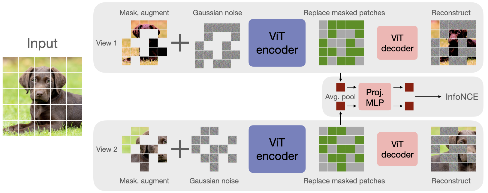

# CAN: Contrastive Masked Autoencoders and Noise Prediction Pretraining

Official PyTorch implementation of ["A simple, efficient and scalable contrastive masked autoencoder for learning visual representations"](https://arxiv.org/abs/2210.16870).

<p align="center">

</p>


## Requirements
- Instructions for creating conda enviroment. <br>


```
  conda env create -f can.yml
  conda activate can
```

## Instructions for running CAN <br>
```
git clone https://github.com/shlokk/mae-contrastive.git
cd mae-contrastive
```


Script for running CAN:

```
OMP_NUM_THREADS=1 python -m torch.distributed.launch --nproc_per_node=4 main_pretrain.py \
    --data_path path_to_imagenet --output_dir can_noise_baseline --log_dir can_baseline_logs \
    --num_workers 8 --blr 2.5e-4 --weight_decay 0.05 --model mae_vit_base_patch16 \
    --batch_size 64 --dist_url 'tcp://localhost:10004' --epochs 50 --weight_simclr 0.03 \ 
    --weight_mae 0.97 --accum_iter 4
```

Script for running MAE baseline:

```
OMP_NUM_THREADS=1 python -m torch.distributed.launch --nproc_per_node=4 main_pretrain.py \
    --data_path path_to_imagenet --output_dir mae_baseline --log_dir mae_baseline_logs \
    --num_workers 8 --blr 1.5e-4 --weight_decay 0.05 --model mae_vit_base_patch16 \
    --batch_size 64 --dist_url 'tcp://localhost:10004' --epochs 50 --weight_simclr 0 \
    --weight_mae 1.0 --accum_iter 4
```

Script for running linear evaluation:
```
OMP_NUM_THREADS=1 python -m torch.distributed.launch --nproc_per_node=4 main_linprobe.py \ 
    --data_path path_to_imagenet --batch_size 512 --model vit_base_patch16 --cls_token \
    --finetune can_noise_baseline/checkpoint-49.pth --epochs 90 --blr 0.1 --weight_decay 0.0 \
    --dist_eval --data_path  path_to_imagenet --output_dir mae_baseline_lineval
```

## Pre-trained models <br>
- We have released pretrained models for 50 epoch pretraining here(https://drive.google.com/file/d/18yVmZmKenM-cZh5o6hmcswvS2ePhuDk_/view?usp=sharing). <br>
- We will be releasing longer epoch training (800 and 1600 epochs) soon.


This repo is heavily inspired by MAE repo https://github.com/facebookresearch/mae.

## Citation
```bibtex
@article{mishra2022simple,
  title={A simple, efficient and scalable contrastive masked autoencoder for learning visual representations},
  author={Mishra, Shlok and Robinson, Joshua and Chang, Huiwen and Jacobs, David and Sarna, Aaron and Maschinot, Aaron and Krishnan, Dilip},
  journal={arXiv preprint arXiv:2210.16870},
  year={2022}
}
